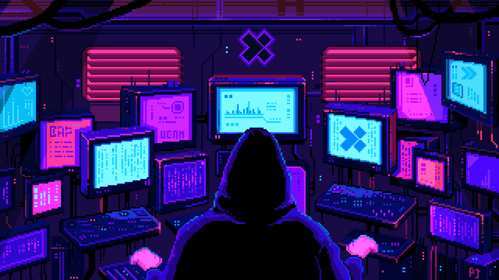
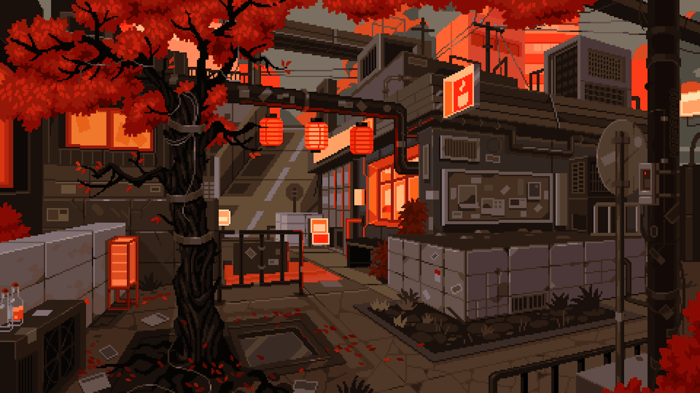
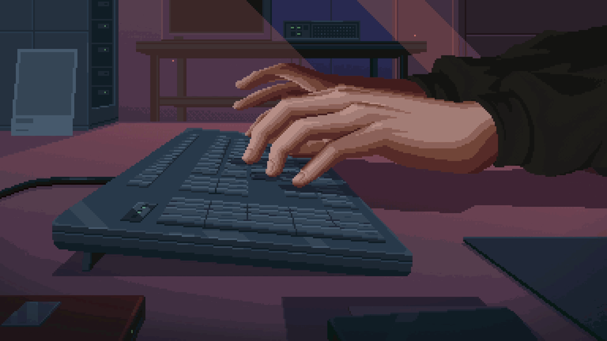
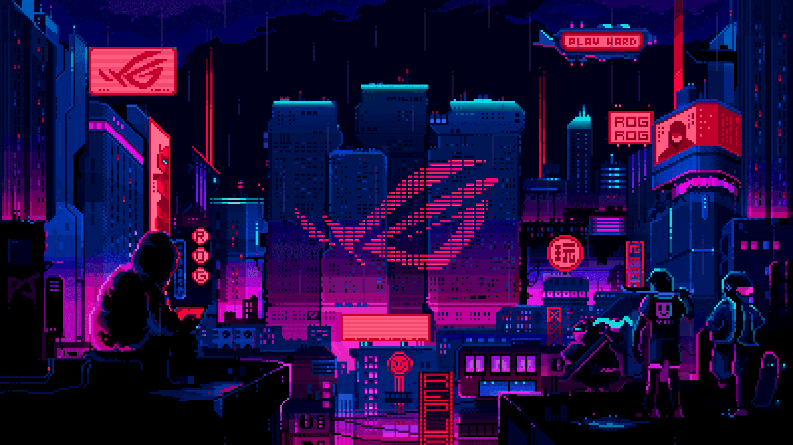
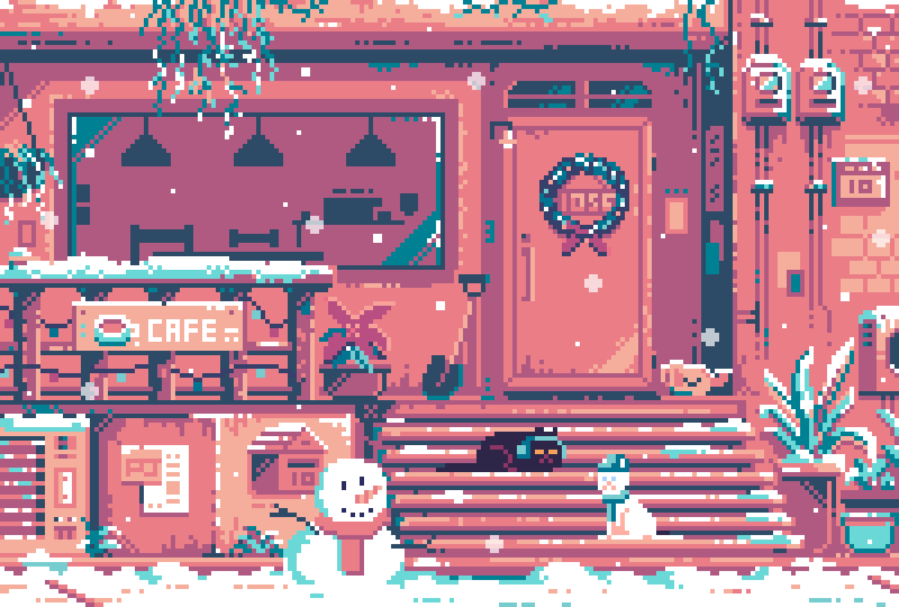
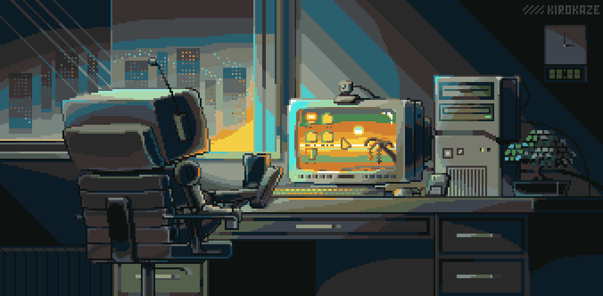
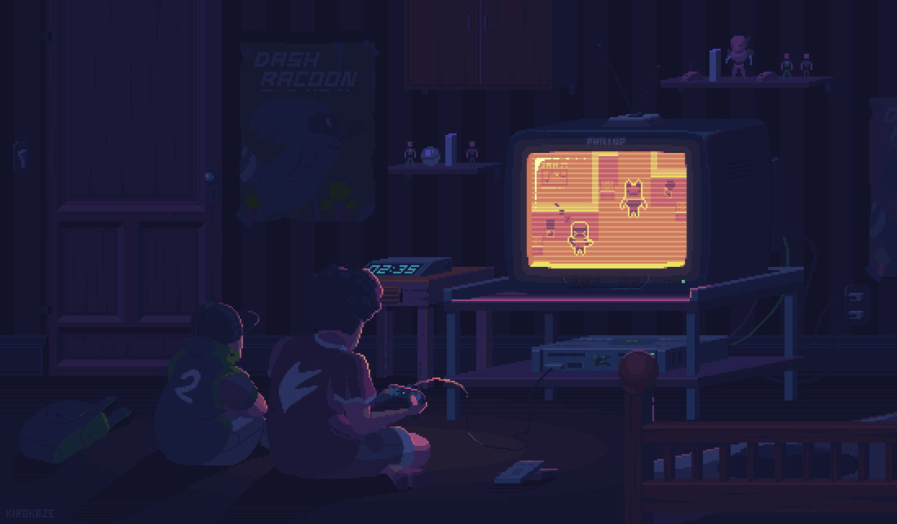

<!-- =========================================================
     DREXOCODER // PROFILE README
     ========================================================= -->

  

 

  

&nbsp;&nbsp;

  

code / create / experiment / repeat

 

---

 

<table width="92%">
<tr>

<td width="58%" valign="middle">

<h2>~/ about</h2>

 

<pre>
┌──────────────────────────────────────────────┐
│                                              │
│  hello, i'm Drexocoder.                     │
│                                              │
│  i build things because ideas                 │
│  are more fun when they actually work.       │
│                                              │
│  games       → systems & mechanics           │
│  bots        → automation & utilities        │
│  web         → interfaces & experiments      │
│  ideas       → whatever comes next            │
│                                              │
│  current mode: BUILDING                      │
│                                              │
└──────────────────────────────────────────────┘
</pre>

 

I enjoy taking unusual ideas and turning them into
real projects, systems and experiences.

</td>

<td width="42%" align="center">

  

<code>STATUS: ONLINE</code>

</td>

</tr>
</table>

 

---

 

  

<h2>currently building</h2>

 

<table width="90%">
<tr>

<td align="center" width="25%">

01

  

<strong>LEGACY</strong>

  

<code>games</code>
 
<code>competition</code>
 
<code>tournaments</code>

</td>

<td align="center" width="25%">

02

  

<strong>NEXORA</strong>

  

<code>bots</code>
 
<code>automation</code>
 
<code>utilities</code>

</td>

<td align="center" width="25%">

03

  

<strong>MIND SCALE</strong>

  

<code>strategy</code>
 
<code>game logic</code>
 
<code>systems</code>

</td>

<td align="center" width="25%">

04

  

<strong>WEB LAB</strong>

  

<code>interfaces</code>
 
<code>simulations</code>
 
<code>experiments</code>

</td>

</tr>
</table>

 

---

 

  

<h2>~/ system status</h2>

<pre>
╭──────────────────────────────────────────────────────────╮
│                                                          │
│  USER        Drexocoder                                  │
│  MODE        BUILD                                       │
│  WORKSPACE   DIGITAL LAB                                 │
│  EDITOR      VS CODE                                     │
│  HOST        GITHUB                                      │
│                                                          │
│  ──────────────────────────────────────────────────────  │
│                                                          │
│  LEGACY      █████████████████░░░    ACTIVE              │
│  NEXORA      ███████████████░░░░    ACTIVE              │
│  MINDSCALE   █████████████░░░░░░    BUILDING            │
│  WEB LAB     ██████████░░░░░░░░░    EXPERIMENTAL       │
│                                                          │
│  ──────────────────────────────────────────────────────  │
│                                                          │
│  > turning ideas into systems...                         │
│                                                          │
╰──────────────────────────────────────────────────────────╯
</pre>

 

---

 

<h2>the project archive</h2>

 

<table width="92%">

<tr>

<td width="50%" valign="top">

<h3>LEGACY GAMES</h3>

  

competitive gaming systems,
tournaments, progression and mechanics.

  

<code>PYTHON</code>
&nbsp;
<code>SQLITE</code>
&nbsp;
<code>TELEGRAM</code>

  

<a href="https://github.com/Drexocoder?tab=repositories">
VIEW PROJECTS →
</a>

</td>

<td width="50%" valign="top">

<h3>NEXORA</h3>

  

a growing ecosystem of bots,
automation tools and utilities.

  

<code>PYTHON</code>
&nbsp;
<code>APIS</code>
&nbsp;
<code>AUTOMATION</code>

  

<a href="https://github.com/Drexocoder?tab=repositories">
VIEW PROJECTS →
</a>

</td>

</tr>

<tr>

<td width="50%" valign="top">

<h3>MIND SCALE</h3>

  

a competitive strategy game built around
numbers, prediction and elimination.

  

<code>PYTHON</code>
&nbsp;
<code>SQLITE</code>
&nbsp;
<code>GAME LOGIC</code>

  

<a href="https://github.com/Drexocoder?tab=repositories">
VIEW PROJECTS →
</a>

</td>

<td width="50%" valign="top">

<h3>WEB LAB</h3>

  

interactive interfaces, simulations
and experimental web experiences.

  

<code>HTML</code>
&nbsp;
<code>CSS</code>
&nbsp;
<code>JAVASCRIPT</code>

  

<a href="https://github.com/Drexocoder?tab=repositories">
VIEW PROJECTS →
</a>

</td>

</tr>

</table>

 

---

 

<h2>the little workshop</h2>

 

  

<pre>
╭──────────────────────────────────────────────╮
│                                              │
│              D R E X O . E X E               │
│                                              │
│              ● SYSTEM ONLINE                 │
│                                              │
│          compiling new ideas...              │
│                                              │
│          ████████████████░░░░                │
│                                              │
│                    87%                       │
│                                              │
╰──────────────────────────────────────────────╯
</pre>

 

---

 

<h2>technology stack</h2>

 

  

<table width="82%">
<tr>

<td align="center">

LANGUAGES

  

<code>Python</code>
&nbsp;
<code>JavaScript</code>
&nbsp;
<code>HTML</code>
&nbsp;
<code>CSS</code>

</td>

<td align="center">

BACKEND

  

<code>Flask</code>
&nbsp;
<code>REST</code>
&nbsp;
<code>Async</code>

</td>

</tr>

<tr>

<td align="center">

DATABASE

  

<code>SQLite</code>
&nbsp;
<code>PostgreSQL</code>
&nbsp;
<code>JSON</code>

</td>

<td align="center">

TOOLS

  

<code>Git</code>
&nbsp;
<code>GitHub</code>
&nbsp;
<code>Docker</code>
&nbsp;
<code>VS Code</code>

</td>

</tr>

</table>

 

---

 

<h2>developer metrics</h2>

 

  

 

---

 

<h2>contribution matrix</h2>

 

 

---

 

<h2>the philosophy</h2>

 

  

<pre>
ideas
  ↓
prototype
  ↓
break everything
  ↓
fix everything
  ↓
ship
  ↓
repeat
</pre>

 

<h3>build it. break it. build it better.</h3>

 

made with code, curiosity and way too many ideas

  

&nbsp;

  

© Drexocoder

